<p align="center">
  
</p>

<h1 align="center">
  <a href="https://git.io/typing-svg"></a>
</h1>

## Table of Contents

- [Introduction](#introduction)
- [Tech Stack](#Tech-Stack)
- [Features](#features)
- [Requirements](#requirements)
- [Instalation](#instalation)
- [Create Environment Variable](#create-environment-variable)
- [Screenshots](#screenshots)
- [Release Project](#related-project)
- [Developed](#Developed-by-the-FWM19-Team)


## Introduction

Welcome to Blanja, your premier destination for all things e-commerce. Blanja offers a seamless and secure online shopping experience, providing a wide range of products to cater to every need and preference.


## Tech Stack

**Programming language:** JavaScript (React JS)

**Framework:** Tailwind CSS

**Plugin:** React Icons, Slick Carousel, React Toastify

[](https://skillicons.dev)


## Features

✨ Users/Customers must log in if want to view & search the product

✨ Seller can add their products to sell to customers

✨ Users/Customers can add the products to their cart for later transaction

✨ Users/Customers can update their profile picture & profile bio

✨ Users/Customers can create their address, update address & delete address

✨ And etc


## Requirements

- [`npm`](https://www.npmjs.com/get-npm)
- [`react`](https://react.dev/learn/start-a-new-react-project)
- [`react-cli`](https://create-react-app.dev/docs/getting-started)
- [`Backend Blanja`](https://github.com/anditorp/blanja-be/tree/master)


## Instalation

#### Clone this repository

```bash
   git clone https://github.com/naufandarmawan/blanja-fe.git
```

#### Install Depedencies

```bash
   npm install
```

#### Start Project

```bash
   npm run dev
```


## Create Environment Variable

If you want to run this environment, you need to add the following environment variables to your .env file

setup server: 

`VITE_URL_BLANJA`


## Screenshots

<table style="width: 100%; border-collapse: collapse;">
  <colgroup>
    <col style="width: 25%;">
    <col style="width: 25%;">
    <col style="width: 25%;">
    <col style="width: 25%;">
  </colgroup>
  <tr>
    <th style="padding: 8px; text-align: center; border: 1px solid #ddd;">Landing Page</th>
    <th style="padding: 8px; text-align: center; border: 1px solid #ddd;">Product Details Page</th>
    <th style="padding: 8px; text-align: center; border: 1px solid #ddd;">Category Page</th>
    <th style="padding: 8px; text-align: center; border: 1px solid #ddd;">Search Page</th>
  </tr>
  <tr>
    <td style="padding: 8px; text-align: left; border: 1px solid #ddd;">
      <div style="width: 100%; height: 300px; overflow: hidden;">
        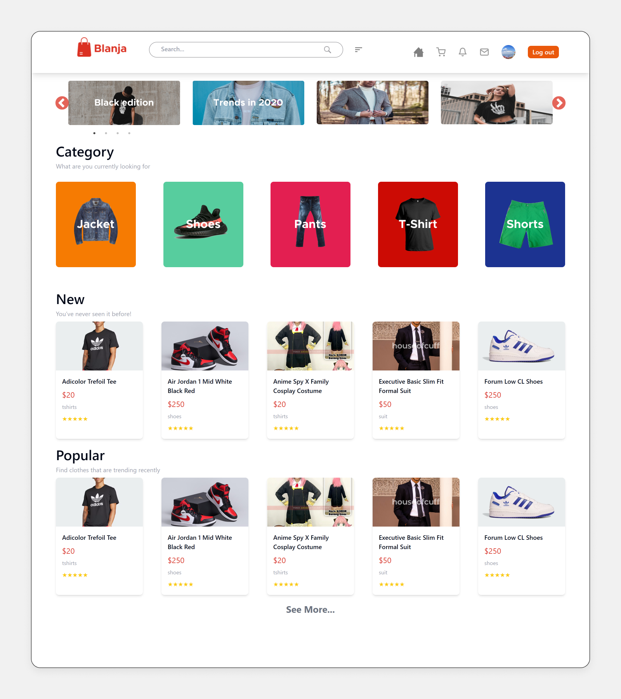
      </div>
    </td>
    <td style="padding: 8px; text-align: left; border: 1px solid #ddd;">
      <div style="width: 100%; height: 300px; overflow: hidden;">
        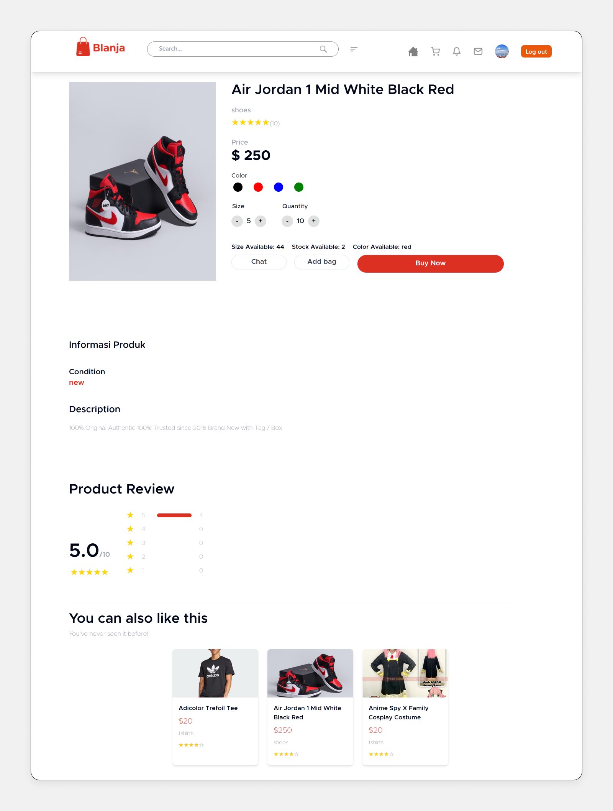
      </div>
    </td>
    <td style="padding: 8px; text-align: left; border: 1px solid #ddd;">
      <div style="width: 100%; height: 300px; overflow: hidden;">
        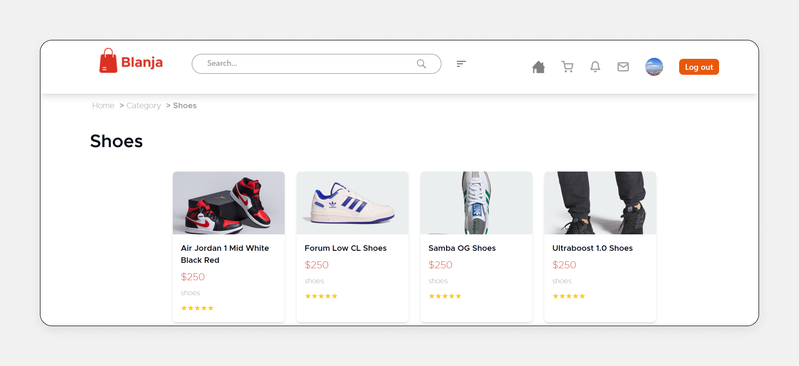
      </div>
    </td>
    <td style="padding: 8px; text-align: left; border: 1px solid #ddd;">
      <div style="width: 100%; height: 300px; overflow: hidden;">
        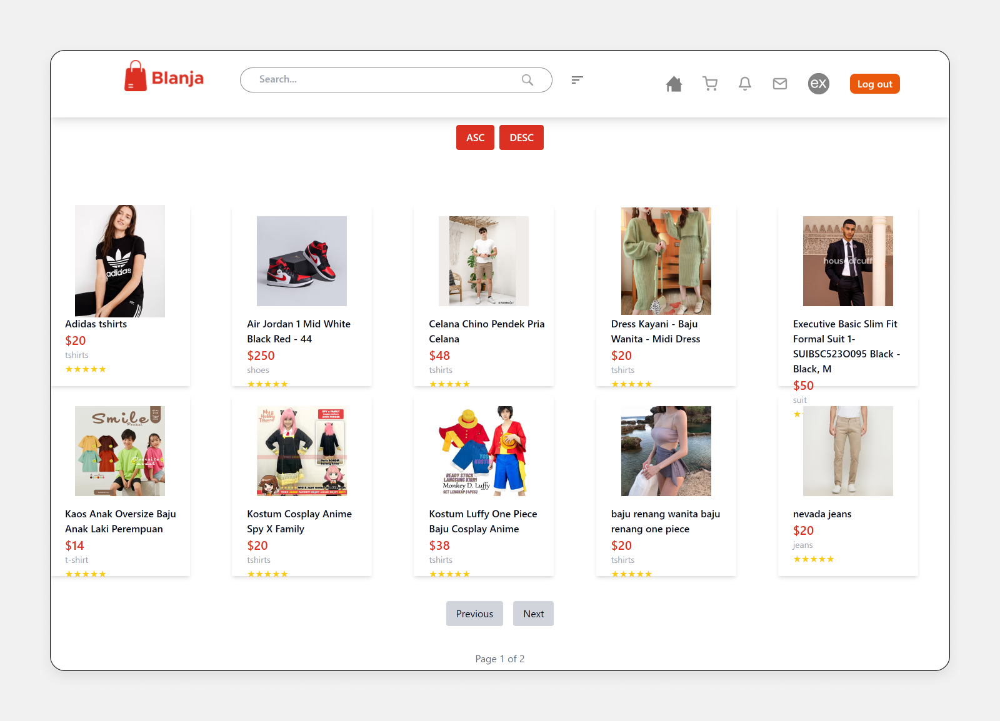
      </div>
    </td>
  </tr>
  <tr>
    <th style="padding: 8px; text-align: center; border: 1px solid #ddd;">My Bag Page</th>
    <th style="padding: 8px; text-align: center; border: 1px solid #ddd;">Checkout Page</th>
    <th style="padding: 8px; text-align: center; border: 1px solid #ddd;">Customer Profile Page</th>
    <th style="padding: 8px; text-align: center; border: 1px solid #ddd;">Customer Shipping Address</th>
  </tr>
 <tr>
    <td style="padding: 8px; text-align: left; border: 1px solid #ddd;">
      <div style="width: 100%; height: 300px; overflow: hidden;">
        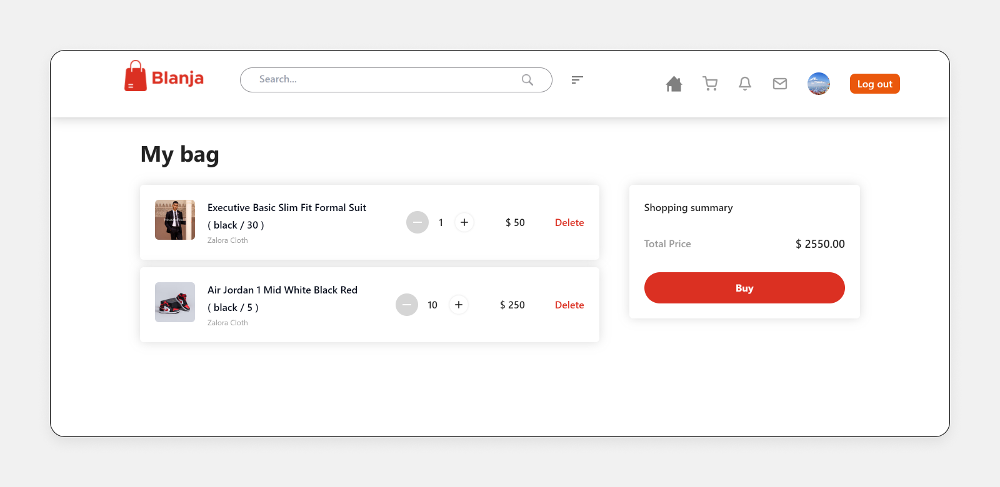
      </div>
    </td>
    <td style="padding: 8px; text-align: left; border: 1px solid #ddd;">
      <div style="width: 100%; height: 300px; overflow: hidden;">
        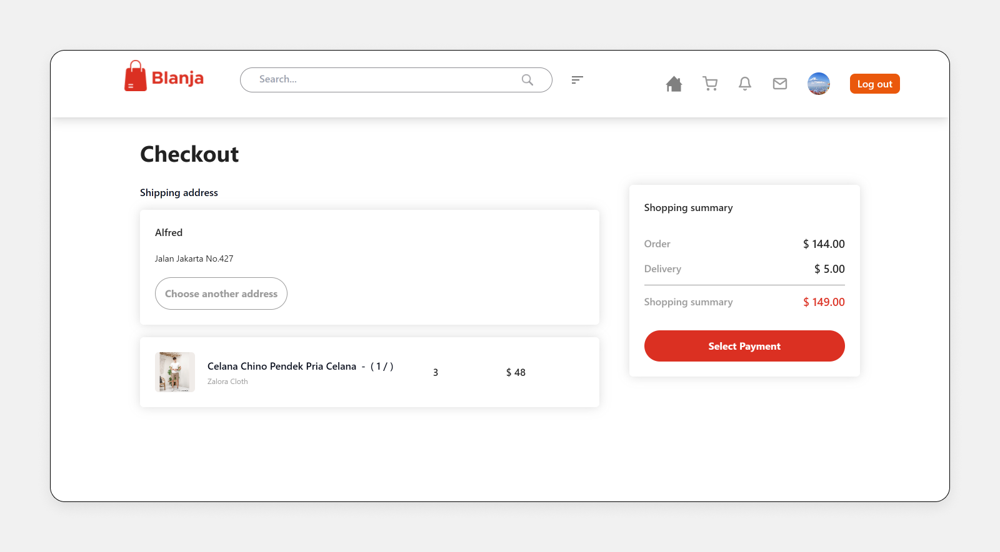
      </div>
    </td>
    <td style="padding: 8px; text-align: left; border: 1px solid #ddd;">
      <div style="width: 100%; height: 300px; overflow: hidden;">
        
      </div>
    </td>
    <td style="padding: 8px; text-align: left; border: 1px solid #ddd;">
      <div style="width: 100%; height: 300px; overflow: hidden;">
        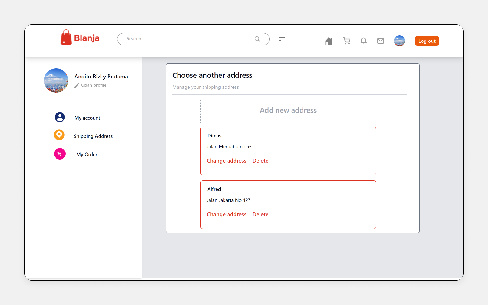
      </div>
    </td>
  </tr>
  <tr>
    <th style="padding: 8px; text-align: center; border: 1px solid #ddd;">Customer Order Page</th>
    <th style="padding: 8px; text-align: center; border: 1px solid #ddd;">Store Profile Page</th>
    <th style="padding: 8px; text-align: center; border: 1px solid #ddd;">Store Product Page</th>
    <th style="padding: 8px; text-align: center; border: 1px solid #ddd;">Sell Product Page</th>
  </tr>
  <tr>
    <td style="padding: 8px; text-align: left; border: 1px solid #ddd;">
      <div style="width: 100%; height: 300px; overflow: hidden;">
        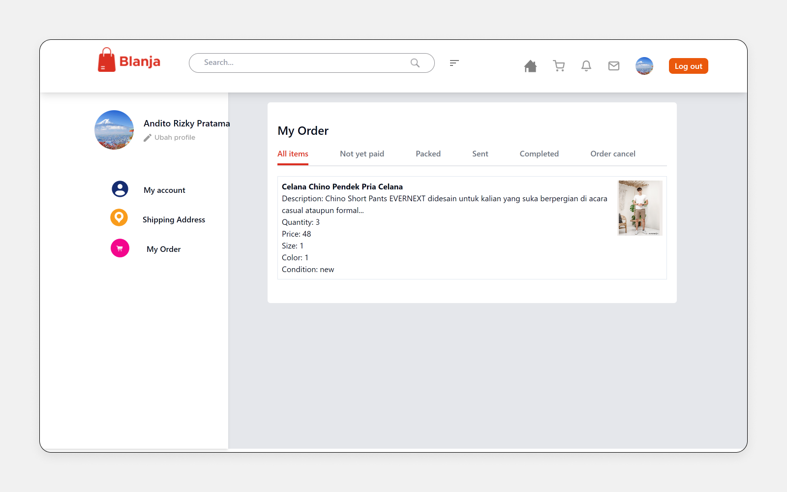
      </div>
    </td>
    <td style="padding: 8px; text-align: left; border: 1px solid #ddd;">
      <div style="width: 100%; height: 300px; overflow: hidden;">
        
      </div>
    </td>
    <td style="padding: 8px; text-align: left; border: 1px solid #ddd;">
      <div style="width: 100%; height: 300px; overflow: hidden;">
        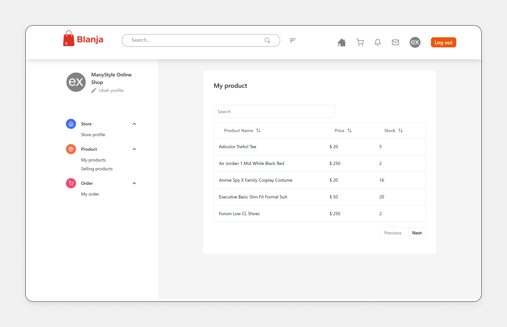
      </div>
    </td>
    <td style="padding: 8px; text-align: left; border: 1px solid #ddd;">
      <div style="width: 100%; height: 300px; overflow: hidden;">
        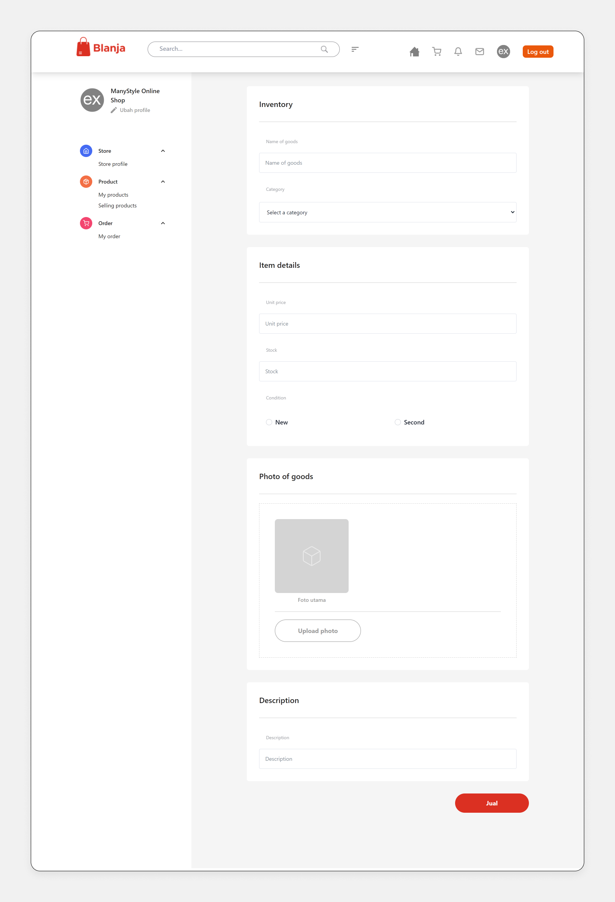
      </div>
    </td>
  </tr>
  <tr>
    <th style="padding: 8px; text-align: center; border: 1px solid #ddd;">Store Order Page</th>
    <th style="padding: 8px; text-align: center; border: 1px solid #ddd;">Customer Login Page</th>
    <th style="padding: 8px; text-align: center; border: 1px solid #ddd;">Store Login Page</th>
    <th style="padding: 8px; text-align: center; border: 1px solid #ddd;">Customer Register Page</th>
  </tr>
  <tr>
    <td style="padding: 8px; text-align: left; border: 1px solid #ddd;">
      <div style="width: 100%; height: 300px; overflow: hidden;">
        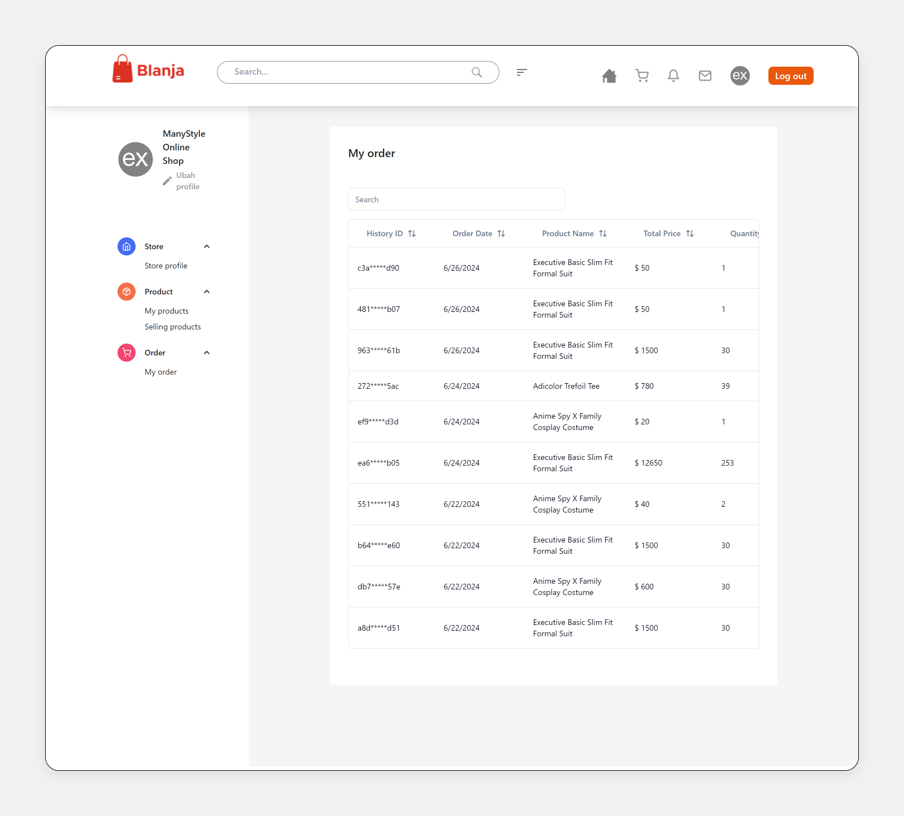
      </div>
    </td>
    <td style="padding: 8px; text-align: left; border: 1px solid #ddd;">
      <div style="width: 100%; height: 300px; overflow: hidden;">
        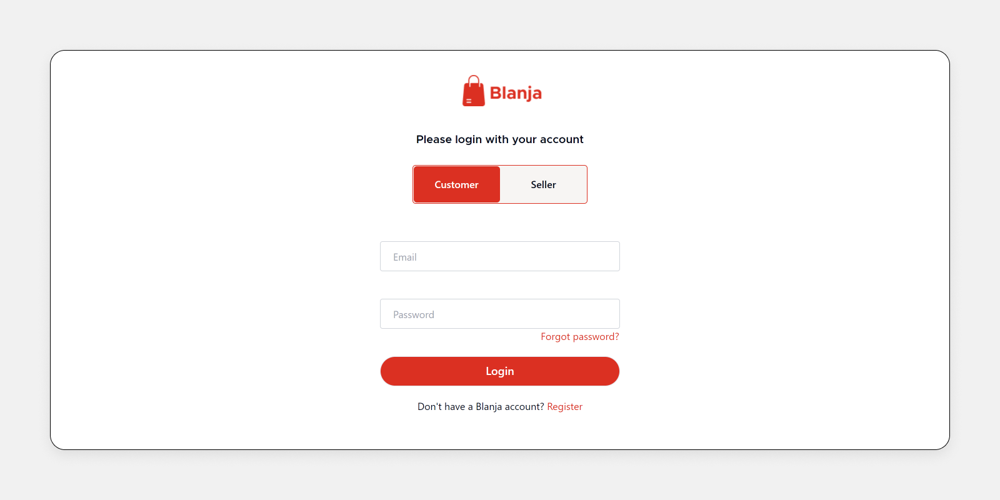
      </div>
    </td>
    <td style="padding: 8px; text-align: left; border: 1px solid #ddd;">
      <div style="width: 100%; height: 300px; overflow: hidden;">
        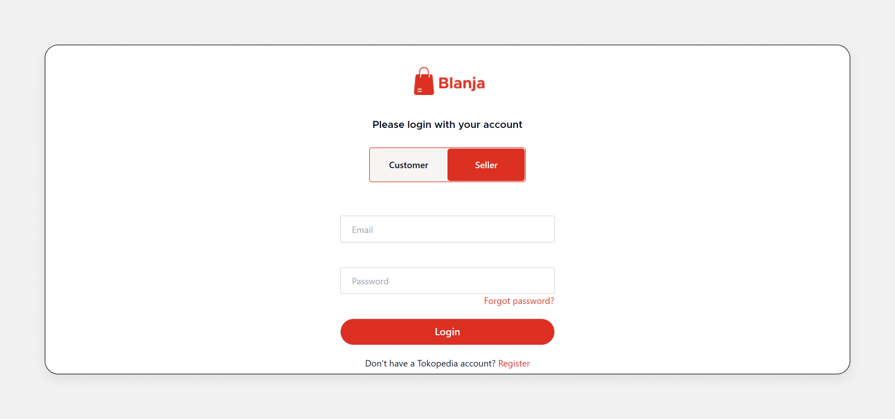
      </div>
    </td>
    <td style="padding: 8px; text-align: left; border: 1px solid #ddd;">
      <div style="width: 100%; height: 300px; overflow: hidden;">
        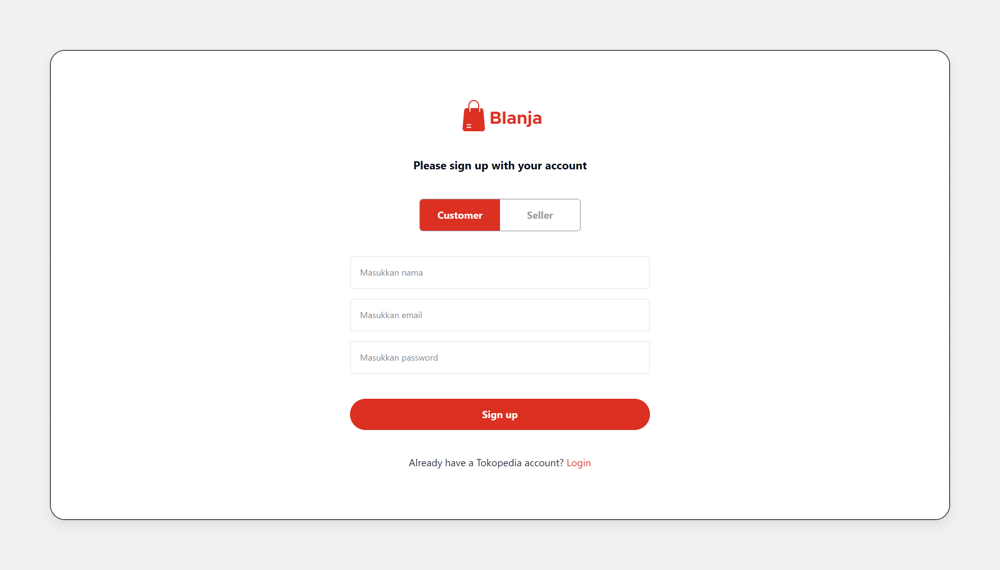
      </div>
    </td>
  </tr>
  <tr>
    <th style="padding: 8px; text-align: center; border: 1px solid #ddd;">Store Order Page</th>
  </tr>
  <tr>
    <td style="padding: 8px; text-align: left; border: 1px solid #ddd;">
      <div style="width: 100%; height: 300px; overflow: hidden;">
        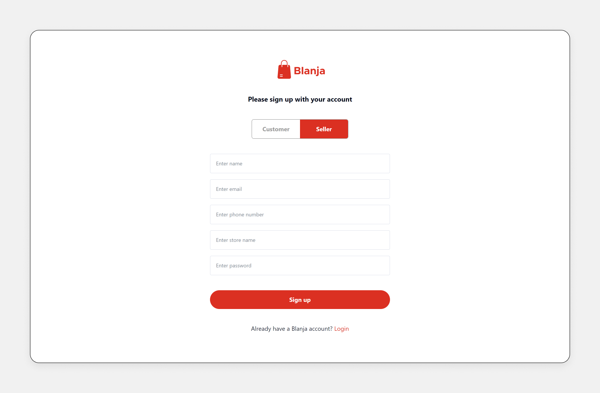
      </div>
    </td>
  </tr>
  <!-- Repeat similar rows for more screenshots -->
</table>
<!-- <div align="center">
    <p>Login Page</p>   
       
    <p>Home Page</p>   
       
</div>
<div align="center">
    <p>Customer Profile</p>   
    
    <p>Shipping Address</p>   
       
</div>
<div align="center">
    <p>Customer Order</p>   
    
    <p>Transaction</p>    
       
</div>
<div align="center">
    <p>Cart</p>    
       
</div> -->


## Release Project
- [`Blanja Demo`](https://blanja-fe-xi.vercel.app/)
- [`Blanja Backend`](https://github.com/naufandarmawan/blanja-be)


## Developed by the FWM19 Team :

💻 [@anditorp](https://github.com/anditorp) as Backend Developer

💻 [@SwitchZer](https://github.com/SwitchZer) as Backend Developer

💻 [@crossxjonathan](https://github.com/crossxjonathan) as Frontend Developer

💻 [@naufandarmawan](https://github.com/naufandarmawan) as Frontend Developer

## License

Distributed under the MIT License. See <a href="https://github.com/naufandarmawan/blanja-fe/blob/main/LICENSE">`LICENSE`</a> for more information.

<p align="right">(<a href="#readme-top">back to top</a>)</p>
